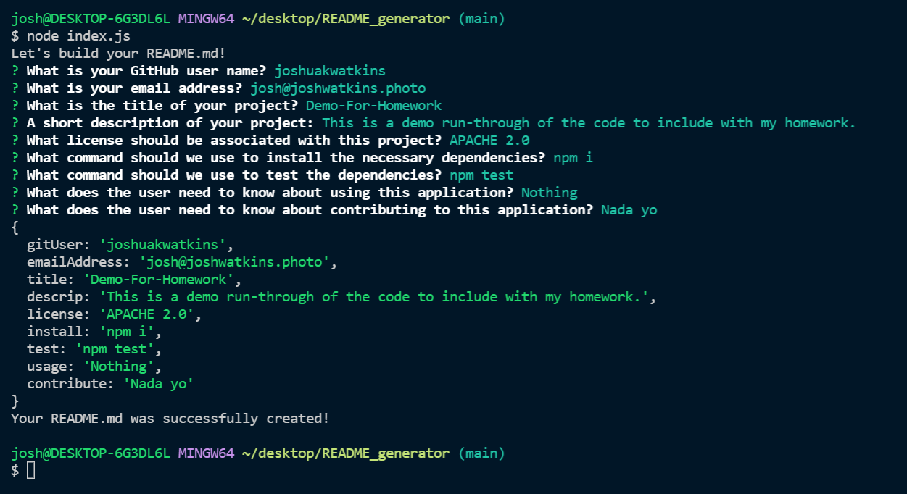

# README_generator
[](https://opensource.org/licenses/MIT)

## Description

This application generates a basic README.md file for the user based on a series of prompts. The goal is to have a quickly assembled and professional README.md that is tailored to a projects needs. This removes pretty much any barrier to entry for a well crafted README.md and thus there is no excuse for not including a README with every project. I may add a query for a picture link to include a screenshot of the application in the readme automatically.

[Here is a link to a video demonstating how it works.](./Video/README_generator.mp4)

[](./Video/README_generator.mp4)

  ## Table Of Contents

* [Installation](#!installation)

* [Usage](#usage)

* [License](#license)

* [Contributing](#contributing)

* [Tests](#tests)

* [Questions](#questions)

================================================

## Installation

To install the necessary dependencies, please run the following command:

```
npm i
```

================================================

## Usage

Nothing special here, just run the index.js file in node after installing the necessary dependencies.

================================================

## License

This project is licensed under the MIT license.

================================================

## Contributing

Nothing special here either.

================================================

## Tests

To test if the dependencies are all installed, please run the following command:

```
npm test
```

================================================

## Questions

If you have any questions please reach out to me [HERE](mailto:josh@joshwatkins.photo). You can find more of my work at [MY GITHUB](https://www.github.com/joshuakwatkins/).


